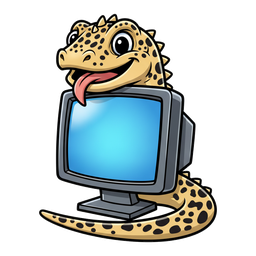
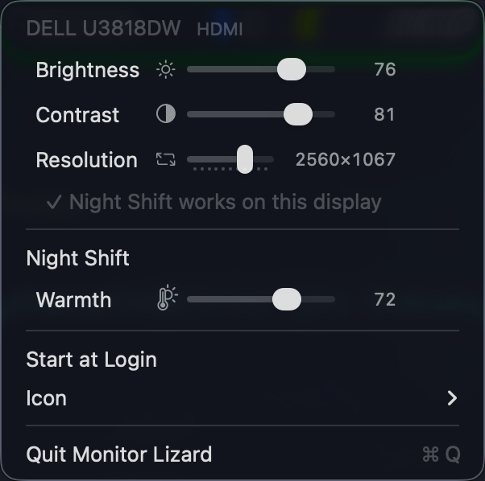

# Monitor Lizard

<p align="center"></p>

A small macOS menu-bar app that controls your **external monitor** from one
dropdown: brightness, contrast, resolution and Night Shift. Nothing else.

Part of the [Menubarn](https://widgets.nicksmith.software) widget library.

## What you get

<p align="center"></p>

One section per display, then Night Shift for the whole Mac:

| Row | What it does |
|-----|--------------|
| **Brightness** | Sets the monitor's own backlight over DDC/CI, like pressing its front buttons. Also works for the built-in screen, and for displays macOS dims itself (TVs over HDMI, Apple and some USB-C monitors — the ones the keyboard brightness keys already work on). |
| **Contrast** | Same, for contrast. |
| **Resolution** | Drag through the sharp HiDPI "looks like" sizes. The `▸` submenu lists every mode. |
| **Night Shift** | Toggle it, and set the warmth. |
| **Dim** | Built-in panel only: dims it past its lowest lit brightness in five steps, down to about a third. The brightness-down key gets there too. Off at every launch. See below. |
| **XDR Brightness** | Built-in XDR panel only: brightens it past its normal maximum. Off at every launch. See below. |
| **Brightness Keys** | The keyboard's brightness keys step the main monitor's brightness, sixteen steps across the range, by the same route as its Brightness row. Needs Accessibility once. |
| **✓ / ⏳ / ✗ line** | Whether Night Shift works on that display. See below. |

Sliders apply live as you drag. Nothing is polled on a timer, and nothing you
set is stored by the app: the monitor keeps its own brightness and macOS keeps
the rest.

## Brightness keys

macOS only lets the brightness keys dim the built-in panel. With **Brightness
Keys** on (the default), Monitor Lizard catches the plain brightness keys and,
when the main display is an external monitor it can drive, steps that
monitor's brightness instead and eats the key; the gecko flicks its tongue as
the change lands. A monitor that refuses DDC but that macOS can dim itself is
stepped through DisplayServices, the same route its Brightness row uses. When
the main display is the built-in panel, or a monitor nothing can drive, the
key passes through untouched and macOS does what it always did, with one
addition: at the built-in panel's lowest lit step, brightness-down **dims**
it (below) instead of switching the screen off. After the deepest dim the
next press switches it off, and brightness-up walks back the same way. Holding a key repeats. `Ctrl` + brightness is never touched, so
[KeyLight](https://github.com/nicholaspsmith/keylight-menubar) still gets it
for the keyboard backlight.

It listens for the media-key event an Apple keyboard sends, which is also what
KeyLight posts for F1/F2 on a third-party keyboard, so both kinds of keyboard
work without the two apps knowing about each other.

An event tap needs **Accessibility**: grant it when prompted, or later from the
menu's "⚠ Grant Accessibility…" row. The app is signed with the same stable
local identity as the other Menubarn apps, so the grant survives rebuilds.

## Dim

On the built-in panel every brightness from macOS's lowest key step (1/16)
down to just above zero lights the backlight the same 1 nit, and zero
switches it off, so macOS has nothing dimmer to offer. **Dim** (under the
built-in display) lays a click-through black overlay over the panel instead.
The keys walk it in five steps that each let through about 20% less light
than the one before: 81, 66, 53, 43 and 35%. So every press is visibly
darker, and the deepest step is still readable. The slider covers the same
range smoothly.

The ladder on the brightness keys is macOS's steps down to 1/16, then the
five dim steps, then off. Up from off comes back at the deepest dim.

The overlay covers everything, menus and the menu bar included. It takes no
clicks, follows you into every Space and full-screen app, and is left out of
screenshots and recordings. The pointer stays at full brightness. It can't
be left behind, because it goes when the app does. It is off every time the
app starts. It turns XDR brightness off, and turning XDR on clears it.
Raising the brightness another way, such as Control Center or auto-brightness
in a brighter room, cancels it.

A gamma table would be the usual way to do this, and it is how XDR
brightness works. Scaled below 1, though, it changes nothing visible on this
panel, in SDR or in HDR mode.

## XDR brightness

On a MacBook Pro with an XDR panel, **XDR Brightness** (under the built-in
display) pushes the whole screen past the normal 500-nit ceiling, up to twice
that, using the headroom the panel keeps for HDR. **Boost** sets how far. It
works the way BrightIntosh does: a single pixel of HDR white in the panel's
top-left corner switches it into HDR mode, and once the panel reports the
headroom a gamma table lifts ordinary white into it.

A leftover gamma table is what scrambles colours after wake with other apps,
so Monitor Lizard only keeps one on the panel while it is safe: it is removed
before sleep, when the displays go to sleep, on quit, whenever the display
setup changes (lid closed, a monitor plugged in), and put back only once
things have settled. After each removal the app reads the table back to make
sure the boost is really gone. It is never applied to external displays, it
is off again every time the app starts, and by default it switches itself off
when you unplug (**Off on Battery**).

Side effects: HDR video can clip its brightest highlights while it is on, and
the panel draws more power and runs warmer.

## Why Night Shift may be off on your monitor

macOS turns Night Shift off on any display it thinks is a **television**, and
it thinks that about plenty of ordinary monitors plugged in over HDMI. Monitor
Lizard spots that, asks for your password **once**, and writes a small override
telling macOS the display is a monitor. Unplug and replug the display (or
reboot) and Night Shift works on it from then on. The app does not need to be
running for the fix to hold.

## The icon

<p align="center"></p>

The mascot, shrunk to the menu bar: a gecko hugging the monitor, head
peering over the top corner, paws on the bezel, tail curling up over the
screen. The screen fills with blue as your main display gets brighter, turns
amber while Night Shift is on, and the gecko flicks its tongue when a slider
change lands on the monitor. Prefer a plain meter? **menu ▸ Icon** offers
Arc, Gauge, Pie or Wedge instead.

## Install

Requires macOS 14 or later on Apple Silicon.

```sh
git clone https://github.com/nicholaspsmith/StatusItemKit ../StatusItemKit
git clone https://github.com/nicholaspsmith/monitor-lizard-menubar
cd monitor-lizard-menubar
./install.sh
```

That builds `Monitor Lizard.app`, links it into `~/Applications` and launches
it. Turn on **Start at Login** from the menu if you want it to stay.

Quit BetterDisplay, MonitorControl or any other DDC tool first. Two apps
talking to one monitor at the same time interfere with each other.

## How it works

- **Brightness and contrast** go over DDC/CI through `IOAVService`, the private
  IOKit interface every Apple Silicon DDC tool uses. One serial queue per
  display, every read confirmed by checksum.
- **Built-in screen brightness** uses DisplayServices, as does any external
  display macOS says it can dim itself (`DisplayServicesCanChangeBrightness`)
  once a DDC read has failed on it. That is the route the keyboard keys take.
- **Brightness keys** come through a `CGEventTap` from
  [HotkeyKit](https://github.com/nicholaspsmith/HotkeyKit), bound to the two
  brightness media keys with no modifiers. They step the main display over
  whichever route its Brightness row uses, DDC or DisplayServices.
- **Night Shift** uses CoreBrightness.
- **The "is this a TV?" flag** comes from CoreDisplay, the same source
  `system_profiler` reads.
- **The TV fix** is a plist at
  `/Library/Displays/Contents/Resources/Overrides/DisplayVendorID-<hex>/DisplayProductID-<hex>`
  containing `DisplayIsTV = false`. macOS reads it when the display attaches.

The app never touches gamma tables.

## Develop

```sh
swift test                 # unit tests, no display needed
scripts/build-app.sh       # builds build/Monitor Lizard.app
log show --last 5m --predicate 'subsystem == "com.nicholaspsmith.MonitorLizard"' --style compact
```

## Why not a SwiftBar plugin?

This is a standalone `.app` built on
[StatusItemKit](https://github.com/nicholaspsmith/StatusItemKit), not a script
under a plugin host: no SwiftBar to install, real AppKit sliders instead of
rendered text, event-driven refresh when displays connect or the Mac wakes,
and an icon that keeps its place in the bar. Sliders need in-process DDC; a
shell-out per tick would lag visibly. The full comparison is in
[StatusItemKit's README](https://github.com/nicholaspsmith/StatusItemKit#why-not-swiftbar).

## License

Copyright (c) 2026 Nicholas Smith. Licensed under the
[Mozilla Public License 2.0](LICENSE). You may use, modify, sell and
redistribute this software, including inside proprietary products, provided
the copyright notice and license stay on these files and any modified
versions of them are made available under the same license.
