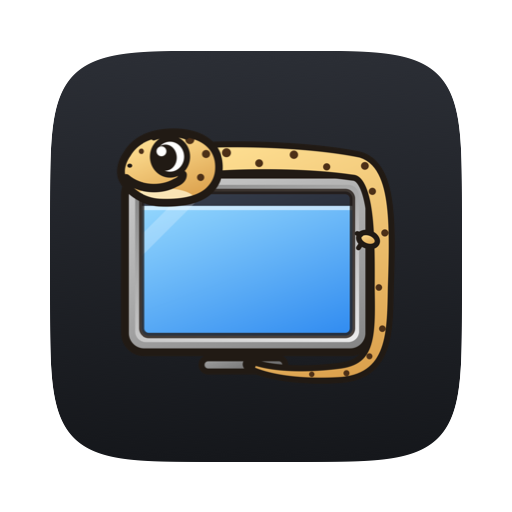
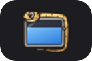
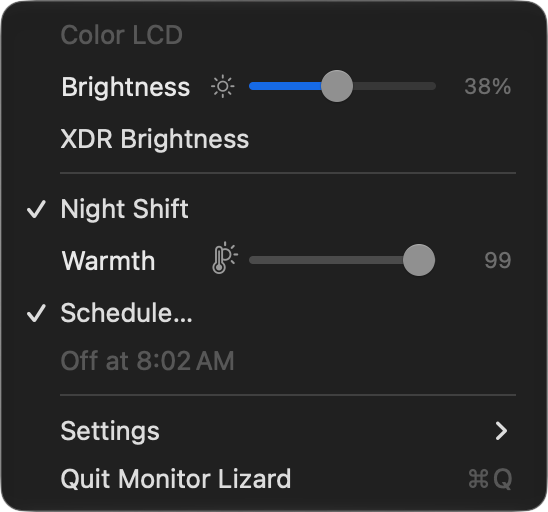
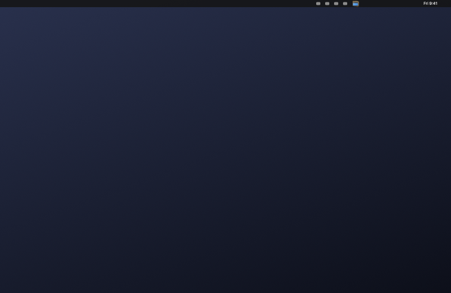
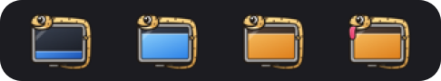

# Monitor Lizard

<p align="center"></p>

<p align="center"></p>

A small macOS menu-bar app that controls your **displays** from one dropdown:
an external monitor's brightness, contrast and resolution, Night Shift, and
the MacBook's own screen from dimmer than macOS allows to brighter than it
allows (XDR).

Part of [Menumon](https://menumon.nicksmith.software).

**Version 1.7.0** · [Changelog](https://github.com/nicholaspsmith/monitor-lizard-menubar/releases)

## What you get

<p align="center"></p>

(The screenshot shows an external monitor; the built-in screen's section has
its one Brightness slider and the XDR Brightness toggle.)

One section per display, then Night Shift for the whole Mac:

| Row | What it does |
|-----|--------------|
| **Brightness** | Sets the monitor's own backlight over DDC/CI, like pressing its front buttons. Also works for displays macOS dims itself (TVs over HDMI, Apple and some USB-C monitors — the ones the keyboard brightness keys already work on). |
| **Contrast** | Same, for contrast. |
| **Resolution** | Drag through the sharp HiDPI "looks like" sizes. The `▸` submenu lists every mode. |
| **Night Shift** | Toggle it, and set the warmth. |
| **Schedule…** | Turn Night Shift on and off by itself, and ramp its warmth through the evening. The line under it says when it next turns on or off. See below. |
| **Brightness** (built-in screen) | One slider for the whole range. The bottom fifth is **Dim**, past the lowest brightness macOS offers. The middle is macOS's own range. With **XDR Brightness** on, the top fifth brightens past full. The brightness keys walk the same ladder. See below. |
| **XDR Brightness** | Built-in XDR panel only: extends the Brightness slider and the brightness-up key past full, into the panel's HDR headroom. Off at every launch. See below. |
| **Settings ▸ Brightness Keys** | The keyboard's brightness keys step the main monitor's brightness, sixteen steps across the range, by the same route as its Brightness row. On the built-in screen they go on into Dim below macOS's lowest step, and into XDR above full. Needs Accessibility once. |
| **✓ / ⏳ / ✗ line** | Whether Night Shift works on that display. See below. |
| **Settings ▸** | Brightness Keys, Icon, Start at Login, and the version. |

Sliders apply live as you drag. Displays are never polled, and the app
stores no display settings (only the Night Shift schedule): the monitor keeps
its own brightness and macOS keeps the rest. Dim and XDR brightness are off every time the app starts.

## Armonitor's laps

Now and then Armonitor, the gecko on the menu-bar icon, runs a lap of his
monitor (3 s). When several Menumon mascots are running they take turns, a
second apart: Archimedes (Claude Usage), Menu Pimp (Mac Daddy), Carol
(SoundChain), Iguanamous (VPN & DNS), then Armonitor (Monitor Lizard),
counting only the ones that are running.

He runs a lap of the whole screen (about 3.4 s) when the app starts, when a
display it has not seen before is connected, and when Night Shift turns on or
off (from the menu, Control Center or its schedule). Sliders never trigger it.
The lap plays in a click-through overlay, so nothing under it stops working.



Both laps are skipped when Reduce Motion is on.

## Brightness keys

macOS only lets the brightness keys dim the built-in panel. With **Brightness
Keys** on (the default), Monitor Lizard catches the plain brightness keys:

- **Main display is an external monitor it can drive** — it steps that
  monitor's brightness over the same route as its Brightness row (DDC, or
  DisplayServices for a monitor that refuses DDC but that macOS can dim) and
  swallows the key. The gecko flicks its tongue as the change lands.
- **Main display is the built-in panel, or a monitor nothing can drive** — the
  key passes through to macOS, except that at the built-in panel's lowest lit
  step brightness-down enters [Dim](#dim) instead of switching the screen off.
  After the deepest dim step the next press switches it off; brightness-up
  walks back the same way. With XDR Brightness on, brightness-up past full
  steps into the boost in four +25% steps.

Holding a key repeats. `Ctrl` + brightness is never touched, so
[KeyLight](https://github.com/nicholaspsmith/keylight-menubar) keeps it for the
keyboard backlight. The app listens for the media-key event an Apple keyboard
sends, which is also what KeyLight posts for F1/F2 on a third-party keyboard,
so both kinds of keyboard work without the apps knowing about each other.

The event tap needs **Accessibility**: grant it when prompted, or later from
the menu's "⚠ Grant Accessibility…" row. The app is signed with the stable
local identity shared by the Menumon apps, so the grant survives rebuilds.

## Dim

On the built-in panel every brightness from macOS's lowest key step (1/16)
down to just above zero gives the same 1-nit backlight, and zero switches it
off. **Dim** (the bottom fifth of the built-in Brightness slider) goes darker
by laying a click-through black overlay over the panel. The keys walk it in
five steps letting through 81, 66, 53, 43 and 35% of the light; the slider
covers the same range smoothly, with a readout such as "Dim 53%". The key
ladder is macOS's steps down to 1/16, then the five dim steps, then off; up
from off returns to the deepest dim step.

The overlay covers everything, menus and the menu bar included. It takes no
clicks, follows you into every Space and full-screen app, and is left out of
screenshots and recordings; the pointer stays at full brightness. It goes when
the app quits and is off every time the app starts. Raising the brightness
another way (Control Center, auto-brightness) cancels it.

## XDR brightness

On a MacBook Pro with an XDR panel, **XDR Brightness** (under the built-in
display) extends the built-in Brightness slider: its top fifth pushes the
whole screen past the normal 500-nit ceiling, up to twice that, using the
panel's HDR headroom. The readout says "XDR +50%" and so on. As in
BrightIntosh, a single pixel of HDR white in the panel's top-left corner
switches it into HDR mode, and once the panel reports headroom a gamma table
lifts ordinary white into it. The headroom ramps up over about two seconds
and moves with brightness, so the table follows it continuously.

A leftover gamma table can scramble colours after wake, so the table is
removed before sleep, when the displays sleep, on quit and whenever the
display setup changes (lid closed, monitor plugged in), and is reapplied only
once things settle. After each removal the app reads the table back to confirm
the boost is gone. It is never applied to external displays and is off every
time the app starts.

On battery, XDR Brightness switches off and the menu shows "XDR Brightness ·
off on battery" until you plug in. To allow it on battery:
`defaults write com.nicholaspsmith.MonitorLizard xdrOffOnBattery -bool false`.

Side effects: HDR video can clip its brightest highlights while it is on, and
the panel draws more power and runs warmer.

## Night Shift schedule

**Schedule…** opens a small window:

- **Turn on**: at sunset, or at a set time. Sunset can be moved up to three
  hours either way ("30 min before sunset").
- **Turn off**: at sunrise, or at a set time, with the same offsets.
- Each sun-based row shows the next sunset or sunrise and the time Night
  Shift will actually switch, offset included.
- **Ramp the warmth**: Night Shift starts with no warmth and climbs to the
  Warmth slider's setting over the first 15 min to 3 h, then fades over the
  same span before it turns off. While the ramp runs, the Warmth slider sets
  the warmth it climbs to.

Switching Night Shift by hand (from the menu or Control Center) holds until
the schedule's next on or off time. Turning the schedule on turns off macOS's
own Night Shift schedule, so the two never fight.

Sunset and sunrise come from the Mac's location when Location Services allow
Monitor Lizard (it asks once, when a schedule first uses the sun), and
otherwise from the main city of your time zone. Set times need no location.

## Why Night Shift may be off on your monitor

macOS turns Night Shift off on any display it thinks is a **television**, and
it thinks that about plenty of ordinary monitors plugged in over HDMI. Monitor
Lizard spots that, asks for your password **once**, and writes a small override
telling macOS the display is a monitor. Unplug and replug the display (or
reboot) and Night Shift works on it from then on. The app does not need to be
running for the fix to hold.

## The icon

<p align="center"></p>

A gecko on a monitor. The screen fills with blue as the main display gets
brighter and turns amber while Night Shift is on; the gecko flicks its tongue
when a slider or key change lands on the monitor. **Icon** in the menu also
offers plain Arc, Gauge, Pie or Wedge meters.

## Install

Requires macOS 14 or later on Apple Silicon, Xcode Command Line Tools, and
[StatusItemKit](https://github.com/nicholaspsmith/StatusItemKit) and
[HotkeyKit](https://github.com/nicholaspsmith/HotkeyKit) cloned **beside** this
repo (the package depends on `../StatusItemKit` and `../HotkeyKit`).

```sh
cd ~/Code
git clone https://github.com/nicholaspsmith/StatusItemKit.git
git clone https://github.com/nicholaspsmith/HotkeyKit.git
git clone https://github.com/nicholaspsmith/monitor-lizard-menubar.git
cd monitor-lizard-menubar && ./install.sh
```

`install.sh` builds `Monitor Lizard.app`, links it into `~/Applications`,
asks whether to turn on **Start at Login**, and launches it. Start at Login is
also in Settings ▸, or run the installed binary:
`"$HOME/Applications/Monitor Lizard.app/Contents/MacOS/MonitorLizard" --login on` (or `off`, `status`).

Quit BetterDisplay, MonitorControl or any other DDC tool first: two apps
talking to one monitor at once interfere with each other.

## How it works

- **Brightness and contrast** go over DDC/CI through `IOAVService`, the private
  IOKit interface every Apple Silicon DDC tool uses. One serial queue per
  display, every read confirmed by checksum.
- **Built-in screen brightness** uses DisplayServices, as does any external
  display macOS says it can dim itself (`DisplayServicesCanChangeBrightness`)
  once a DDC read has failed on it. That is the route the keyboard keys take.
- **Brightness keys** come through a `CGEventTap` from
  [HotkeyKit](https://github.com/nicholaspsmith/HotkeyKit), bound to the two
  brightness media keys with no modifiers. They step the main display over
  whichever route its Brightness row uses, DDC or DisplayServices. On the
  built-in panel they pass through to macOS down to 1/16, then drive Dim.
- **Dim** is a borderless black `NSWindow` per built-in panel at
  `.screenSaver` level, click-through, `sharingType = .none`, joining every
  Space. Its opacity is `1 − 0.35^level`. (Gamma tables scaled below 1 change
  nothing visible on this panel, in SDR or HDR, so Dim cannot use one.)
- **XDR brightness** is a one-pixel EDR Metal window that puts the panel in
  HDR mode, plus a transfer table (`CGSetDisplayTransferByTable`) that lifts
  SDR white into the headroom.
- **Night Shift** uses CoreBrightness.
- **The "is this a TV?" flag** comes from CoreDisplay, the same source
  `system_profiler` reads.
- **The TV fix** is a plist at
  `/Library/Displays/Contents/Resources/Overrides/DisplayVendorID-<hex>/DisplayProductID-<hex>`
  containing `DisplayIsTV = false`. macOS reads it when the display attaches.

## Develop

```sh
swift test                 # unit tests, no display needed
scripts/build-app.sh       # builds build/Monitor Lizard.app
log show --last 5m --predicate 'subsystem == "com.nicholaspsmith.MonitorLizard"' --style compact
```

## Releasing

Every push to `main` is a release. Before pushing, add a dated
`## [X.Y.Z] - YYYY-MM-DD` section to the top of [`CHANGELOG.md`](CHANGELOG.md)
(minor for features, patch for fixes; turn a waiting `## [Unreleased]` into
it). When it reaches `main`, GitHub tags `vX.Y.Z` and publishes the section as
a release titled `vX.Y.Z`. Without a new version:

- a push is refused locally by the `pre-push` hook;
- a pull request **cannot merge** — `release / check` is required on `main`;
- a push that reaches `main` anyway fails the release workflow.

The one exception is `[no release]` in the tip commit's message, for changes
nothing a user runs (setup, CI, developer docs): it passes every check with no
version bump and no tag. Never tag or create a release by hand, and never
`gh pr merge --admin` past a failing check — fix the PR. After merging, `git pull` for the tag, rebuild (the menu's Version row is
stamped from it), and update the version line at the top of this README. `install.sh` re-arms the hook on a fresh clone.
See [StatusItemKit — Releases](https://github.com/nicholaspsmith/StatusItemKit#releases-every-push-is-one) for the whole rule.

## License

Copyright (c) 2026 Nicholas Smith. Licensed under the
[Mozilla Public License 2.0](LICENSE). You may use, modify, sell and
redistribute this software, including inside proprietary products, provided
the copyright notice and license stay on these files and any modified
versions of them are made available under the same license.
